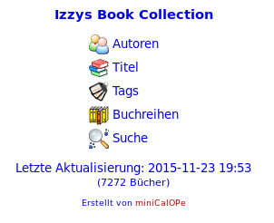

## miniCalOPe

miniCalOPe is a basic OPDS (and HTML) catalog provider for eBooks.
It allows you to present your collection of eBooks (ePub & Mobi)
on the net (LAN and/or WAN) in order for eBook readers to directly connect and
download books, and also to allow people to access it with their web browsers
to walk through it.

This little program is (c)opyrighted by Andreas Itzchak Rehberg
(devel AT izzysoft DOT de) and protected by the GNU Public License Version 2
(GPL). For details on the License see the file LICENSE in the `doc/` directory.
The contents of this archive may only be distributed all together.

### Requirements
miniCalOPe requires a web server powered by PHP 5.4+ with SQLite3 to present its
data. For data collection and preparation, you will need the PHP CLI (again with
SQLite3 support). If you want to integrate Amazon ads, *miniCalOPe* supports that
via the [Amazon Simple Api for PHP](https://github.com/IzzySoft/Asap), which then
must be installed in your PHP `include_path`.

### Limitations
No warranties at all :) For more, see also the other documentation files and man
pages. If you think there's something missing here, don't hesitate to notify the
author (me) about it - chances are quite good it will be added if possible. A
good way to do this is to open an issue at the [Github Project
Page](https://github.com/IzzySoft/miniCalOPe).

### Additional Information
For additional information you may want to visit the
[wiki](https://github.com/IzzySoft/miniCalOPe/wiki). To file a bug report,
feature request or simply have a look at the current development, please use
the [issues tab on the project's wiki
page](https://github.com/IzzySoft/miniCalOPe/issues). To see miniCalOPe live in
action, visit [Izzy's eBook Library](https://ebooks.qumran.org/) – where you
can find thousands of eBooks, available at no cost for your personal use.
